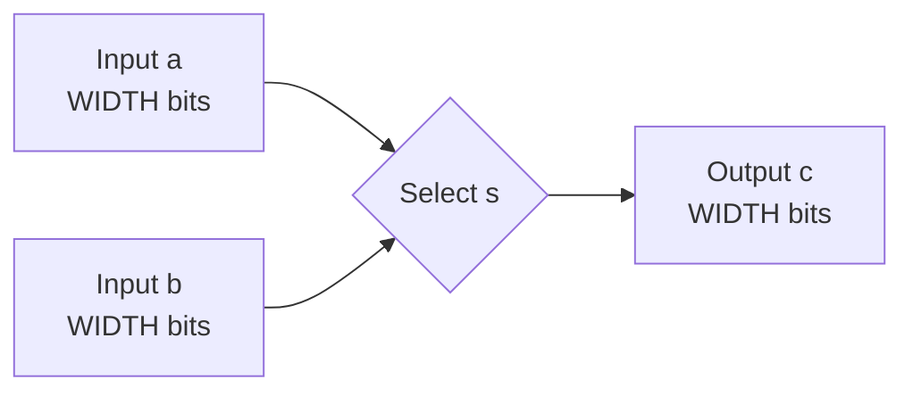

# Subproject 01 - Parameterized 2:1 Multiplexer

## Engineering objective

Implement and verify the combinational selection primitive used three times in
the final datapath: next-PC selection, ALU operand selection, and write-back
selection. Although structurally simple, this block establishes the repository's
coding and self-checking verification conventions.



## Interface contract

| Signal | Direction | Width | Meaning |
|---|---:|---:|---|
| `a` | input | `WIDTH` | Selected when `s=0` |
| `b` | input | `WIDTH` | Selected when `s=1` |
| `s` | input | 1 | Data-path selector |
| `c` | output | `WIDTH` | Selected combinational value |

## RTL decisions

- The module is parameterized so the same implementation can be reused for any
  bus width.
- A continuous assignment expresses the absence of state and avoids accidental
  latch inference.
- There is no clock or reset because output behavior depends only on current
  inputs.

## Verification strategy

`Mux_tb.v` applies both selector states and then returns to `s=0` to confirm that
selection is reversible. The testbench uses case-inequality (`!==`) so unknown
or high-impedance output values fail the regression.

## Files

- `Mux.v` - synthesizable parameterized RTL.
- `Mux_tb.v` - directed, self-checking testbench.
- `run_questa.do` - QuestaSim/ModelSim compile, run, and VCD export flow.

## Run

```bash
vsim -c -do run_questa.do
gtkwave mux.vcd
```

Expected terminal verdict: `TEST MUX PASSED`.

## Review focus

This subproject demonstrates precise combinational intent, reusable
parameterization, four-state-aware checking, and a minimal reproducible
simulation flow.

## Verification matrix

| Requirement | Stimulus | Acceptance criterion |
|---|---|---|
| Select input `a` | `s=0` | `c===a` after combinational settling |
| Select input `b` | `s=1` | `c===b` after combinational settling |
| Recover from selector transition | `0 -> 1 -> 0` | No retained state or stale value |
| Reject unknown output | Four-state comparison | Any `X` or `Z` causes test failure |

## Integration role

The same primitive is instantiated for next-PC selection, register/Immediate
selection at the ALU input, and ALU/memory selection on the write-back path.
Keeping this block parameterized avoids width-specific copies and makes the
selection intent explicit during synthesis review.

## Scope boundary

The block has no enable, reset, clock, tri-state behavior, or arbitration logic.
Those concerns belong to the surrounding datapath and are intentionally kept out
of this primitive.
